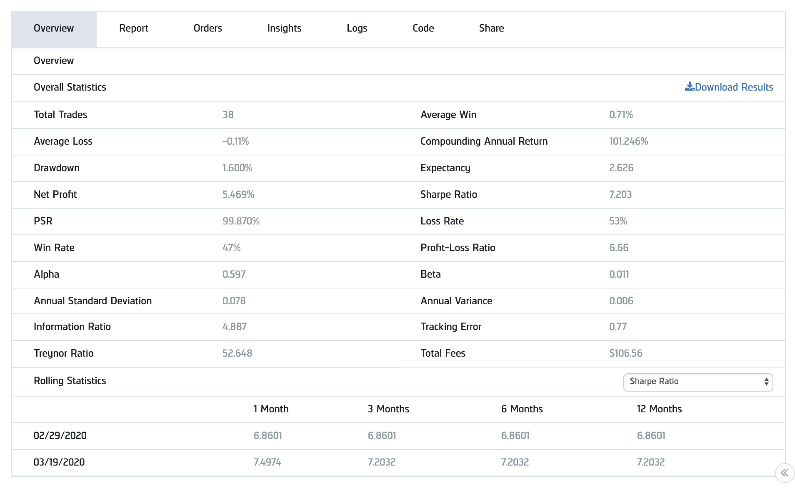

# Corona_Gap_Trader

<h3>Strategy Inspiration </h3>
The rapid US credit spread increase and the drop of the traditionally inversely correlated S&P500 Index (SPY) in mid February 2020 marked the advent of a regime shift in the market. There was a sharp increase in volatility and trade volume; despite the strong downwards momentum in the market, I noticed that there was a recurring mean-reversion pattern that occurred in market open. If $SPY gapped down, the index would mean-revert in the inverse direction at market open more often than not; likewise, if $SPY gapped up, it would mean-revert downward.

To account for this phenomenon I primarily offer 3 similar and mutually-inclusive explanations:
<ol>
<li>Firstly, it could be a result of people covering for their positions. This explains the sharpness of the mean-reversion trend as investors and traders are likely scrambling to cover their puts or calls. </li>
<li>Secondly and akin to the first reason, it could represent investors getting margin-called: this is especially true in cases where the after-hours/pre-market gap is extremely large: leveraged investors who held positions inverse to the direction of the gap could be forced to cut their losses ASAP.</li>
<li>Lastly, it could also represent investors hedging their positions. After a large gap up or down, investors might be more wary about continuing to hold a certain position as the market's momentum could be decaying; thus, this could potentially prompt investors to hedge their positions in the opposite direction to prevent large losses. This explanation is particularly plausible because we can observe that most of the market-open mean-reversion movements are still quite small compared to the gaps themselves.</li>
</ol>

<h3>Strategy Implementation </h3>
The basic idea was to buy $SPXL (3x leveraged $SPY) whenever $SPY gapped down and buy $SPXS (3x inverse leveraged $SPY) whenever $SPY gapped up. I would buy an amount that was directly proportional to the percentage change in $SPY from the previous adjusted market close to market open.

<h3>Alpha V1</h3>
The initial version of the algorithm can be thought of as a simplistic implementation of the idea. I consolidated data into 4-minute segment bars and the strategy would liquidate all assets whenever there was a consolidated bar that suggested a move in the opposite direction OR at market close.

<h3>Alpha V1 Evaluation </h3>

 The results of the V1 were surprisingly good for February 2020 - March 2020, boasting a monthly return approaching 5.5% (101% APR) and a 7.2 sharpe ratio (wtf).

![Month Test]
(https://github.com/Marblez/Corona_Gap_Trader/blob/master/V1/monthtest.png)
However, I attributed these results to the fact that the model was highly overfitted to the Corona trading period. If we conduct the backtest over the course of a year we will see that the algorithm performs really poorly until the mid-February Corona-incited regime shift.
![Year Test]
(https://github.com/Marblez/Corona_Gap_Trader/blob/master/V1/yeartest.png)
